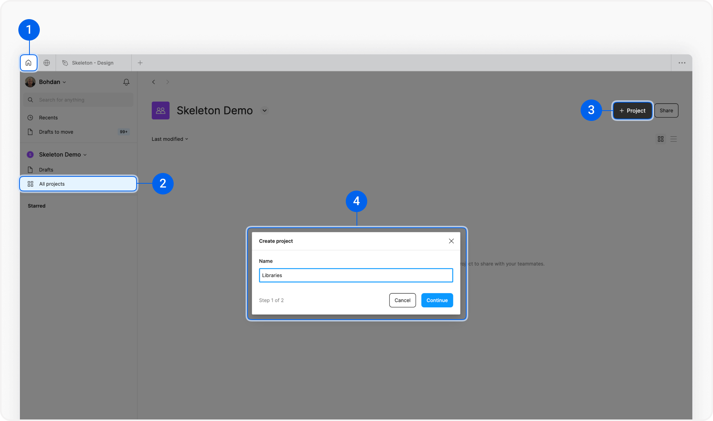
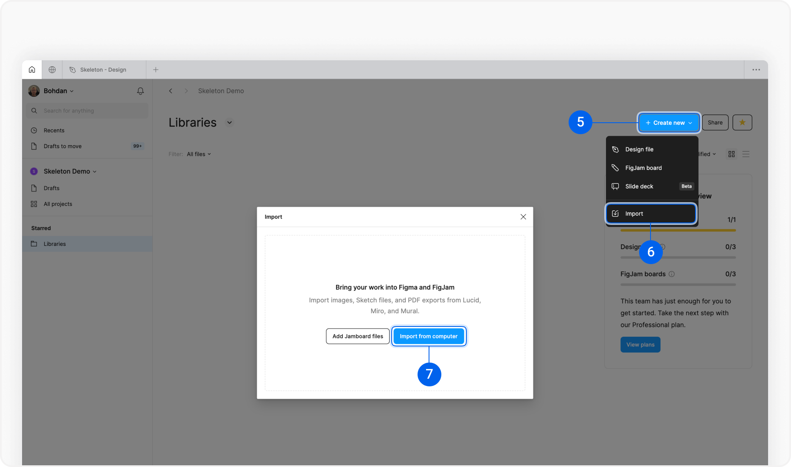
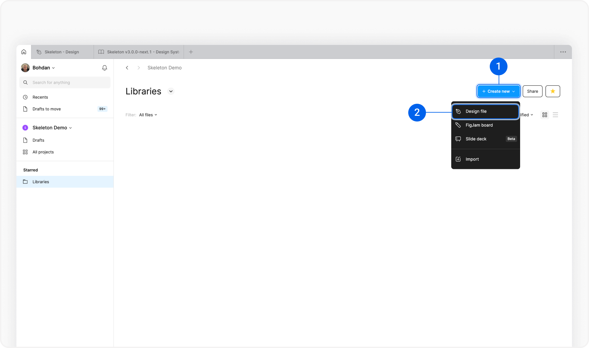
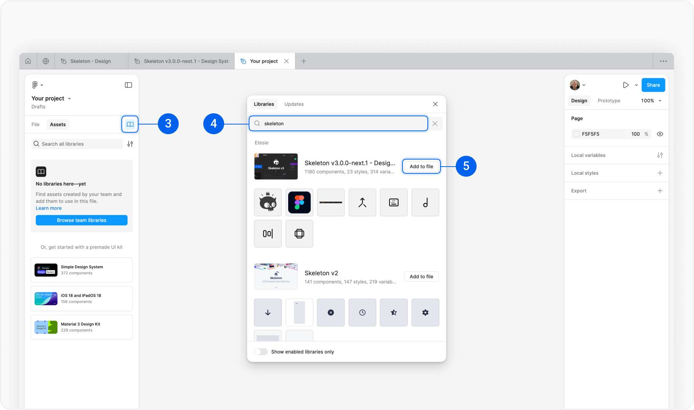

export const components = componentSet;

<iframe
  src="https://iframe.videodelivery.net/5d5bc37ffcf54c9b82e996823bffbb81?mute=true&preload=auto&primaryColor=aliceblue&letterboxColor=aliceblue"
  style="border: none"
  className='aspect-video w-full rounded-container '
  allow="accelerometer; gyroscope; autoplay; encrypted-media; picture-in-picture;"
  allowfullscreen="true"
></iframe>

## How to install the Figma library

Figma Professional Team,  Organization, or  Enterprise Plan recommended.

### 1. Download Figma File

<h6 className="h6">Skeleton Figma Design System</h6>

Full list of themed components form Skeleton Next

<a href="https://polar.sh/skeleton-kit/" type="button" class="btn preset-filled" target="_blank">Download</a>

### 2. Create a new Project

Open “Home” and select “All projects” on the left sidebar. Then on the right side, click “+ Project” and name it “Libraries”.

### 3. Import Skeleton design system

On the project page, click “Create new” on the top-right and select “Import”. After that, click on “Import from computer” and select the Figma file.

### 4. Publish Skeleton Figma library

To be able to use the Figma library in all your Figma files, you need to publish it.

Double-click on the Skeleton Library to open it. At the top left, you find the library file name, and right next to it, a chevron (v). Click on it and select “Publish library…”. Right after the modal appears, click the “Publish” button and wait for it to publish the library.

After you successfully published Skeleton Figma Library you are able to use it within all your projects.

## How to use the Figma library

### 1. Open or create the project where you want to use the library

Double-click on an existing project or create a new one by clicking on the “+ Create new” and select “Design file”. 

### 2. Add the library to your project

On the left sidebar, click on “Assets” and then on the “Book” icon. The modal will appear with the “Libraries” tab active. Search for “skeleton” and click on “Add to file.” 

Now, the library has been added to your file, and you can use its assets.

### 3. Use assets (components)

Now, you can use the Skeleton Design library. On the “Assets” tab, you will see a list of Skeleton Components. You can drag components to the canvas or search for a specific one.

---

### You’ve completed a guide

You should now understand how to install and use Skeleton Figma Library in your projects.

NEXT GUIDE:

## Set-up your own Theme